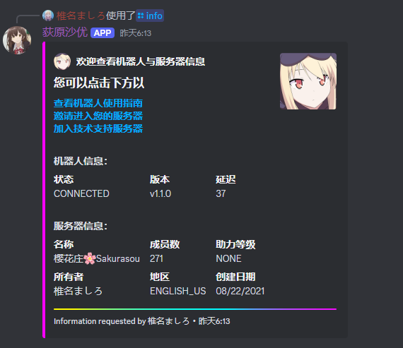
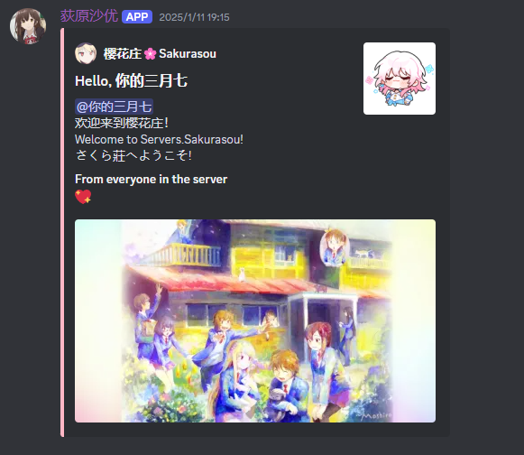
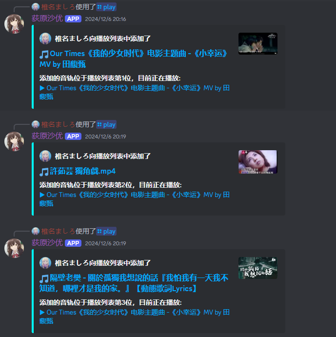
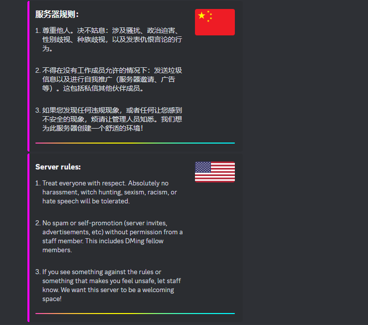
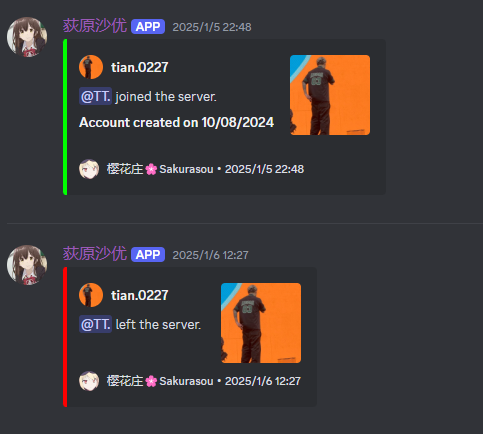

> [!TIP]  
> For user manual in Chinese, click [中文版使用指南](https://github.com/MashiroSakurasou/CN_DiscordBotUserManual). 

# Discord Bot Ogiwara Sayu User Manual 🌟  
Hello! Ogiwara Sayu is feature-rich and customizable **Discord bot for music and moderation.**  

### 🛠 **Invite the Bot**  
Click the link below to invite the bot to your server:  
👉 [Invite Ogiwara Sayu](https://discord.com/oauth2/authorize?client_id=1240521816582262845&permissions=8&integration_type=0&scope=bot)  

## ⚙️ **Slash Command Guide**
### Command Overview
| Command            | Description                                                                                 |
|--------------------|---------------------------------------------------------------------------------------------|
| /play + Name/Link  | Play an audio source. Supports name search or links (e.g., YouTube, SoundCloud).            |
| /skip              | Skip the currently playing audio source.                                                   |
| /info              | View detailed information about the server and the bot.                                     |

> [!TIP]
> The bot will search for the audio name you entered on YouTube and play the first search result.
> - If the audio is not what you intended, try using more specific keywords (e.g., artist name or album title).

> [!NOTE]
> - **Platform Support Limitations**: Currently, only links from the following platforms are supported: **YouTube**, **SoundCloud**, **Bandcamp**, **Vimeo**, and **Twitch Streams**. Links from other platforms may not work.  
> - **Playlist Limitations**: For YouTube playlists, the bot will play all songs in sequence, but there may be slight delays depending on network conditions.  
> - **Connection Issues**: Ensure the bot has joined the voice channel correctly, and that your server permissions allow the bot to play audio, or commands may not function properly.  
> - **Copyright Issues**: Make sure the content you play complies with relevant copyright laws to avoid potential infringement.

## 🎨 Features and Customization

The `/info` command is a default feature available on every server.

  

In addition, the bot supports various customizable features to meet your personalized needs.

For customization requests, please join our [Official Discord Server](https://discord.gg/67vMVwTNuG) and contact 椎名ましろ (shiina.mashiro.) to discuss your requirements.

Below are some examples:

1. Welcome Messages  2. Music Request Interface  3. Server Rules  4. Member Logs  

  
 

## 💬 **Bug Reports and Suggestions**  
We highly value your feedback! Please join our [official Discord server](https://discord.gg/67vMVwTNuG) and send a direct message to **Shiina Mashiro (shiina.mashiro.)** to report any issues or provide suggestions.  
